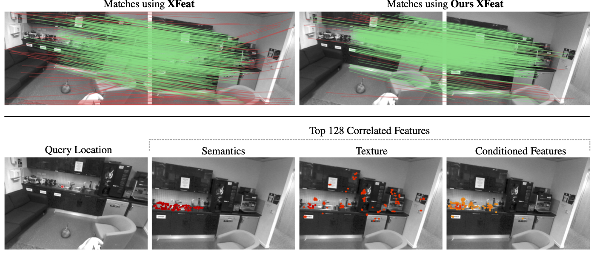

<p align="center">
  <h1 align="center"> Leveraging Semantic Cues from Foundation Vision Models for Enhanced Local Feature Correspondence <br>⭐ACCV 2024⭐</h1>
  <p align="center">
    <a href="https://eucadar.com">Felipe Cadar</a>
    ·
    <a href="https://guipotje.github.io">Guilherme Potje</a>
    ·
    <a href="https://renatojmsdh.github.io">Renato Mastins</a>
    ·
    <a href="https://sites.google.com/view/cedricdemonceaux/home">Cédric Demonceaux</a>
    ·
    <a href="https://homepages.dcc.ufmg.br/~erickson/">Erickson R Nascimento</a>
  </p>
  <h2 align="center"><p>
    <a href="https://arxiv.org/abs/2410.09533" align="center">Paper</a>
    <!-- <a href="https://www.verlab.dcc.ufmg.br/descriptors/reasoning_accv24" align="center">Project Page (Soon)</a> -->
  </p></h2>
  <div align="center"></div>
</p>
<br/>
<p align="center">
    
    <br>
    <em>Leveraging semantic information for improving visual correspondence.</em>
</p>

## Installation

To set up the environment for training, run the following command to create a new conda environment. We recommend using Python 3.9:

```bash
conda create -n reason  python=3.9
```

Activate the environment before proceeding:
```bash
conda activate reason
```

Install the package:
```bash
pip install -e .
```

# Inference

```python
from reasoning.features.desc_reasoning import load_reasoning_from_checkpoint, Reasoning

# load the model with pre-trained weights
semantic_reasoning = load_reasoning_from_checkpoint('models/xfeat/')
# load it into the auxiliary class
reasoning_model = Reasoning(semantic_reasoning['model'])

# match two images
match_response = reasoning_model.match({
    'image0': image0, # BxCxHxW normalized to [0,1]
    'image1': image1  # BxCxHxW normalized to [0,1]
})

# get the matches
mkpts0 = match_response['matches0'] # BxNx2
mkpts1 = match_response['matches1'] # BxNx2
```

The [example.py](example.py) script shows how to automatically download and run a specific model.

The following table contains links to all the models and weights we used in our experiments. 

| Descriptor | Pre-trained weights | Size |
| --- | --- | --- |
| xfeat | [Download](https://github.com/verlab/DescriptorReasoning_ACCV_2024/releases/download/weights/xfeat.zip) | 91.6 MB |
| superpoint | [Download](https://github.com/verlab/DescriptorReasoning_ACCV_2024/releases/download/weights/superpoint.zip) | 91.0 MB |
| alike | [Download](https://github.com/verlab/DescriptorReasoning_ACCV_2024/releases/download/weights/alike.zip) | 92.1 MB |
| aliked | [Download](https://github.com/verlab/DescriptorReasoning_ACCV_2024/releases/download/weights/aliked.zip) | 91.9 MB |
| dedode_B | [Download](https://github.com/verlab/DescriptorReasoning_ACCV_2024/releases/download/weights/dedode_B.zip) | 92.2 MB |
| dedode_G | [Download](https://github.com/verlab/DescriptorReasoning_ACCV_2024/releases/download/weights/dedode_G.zip) | 94.1 MB |
| xfeat-12_layers-dino_G | [Download](https://github.com/verlab/DescriptorReasoning_ACCV_2024/releases/download/weights/xfeat-12_layers-dino_G.zip) | 221.0 MB |
| xfeat-12_layers | [Download](https://github.com/verlab/DescriptorReasoning_ACCV_2024/releases/download/weights/xfeat-12_layers.zip) | 219.0 MB |
| xfeat-3_layers | [Download](https://github.com/verlab/DescriptorReasoning_ACCV_2024/releases/download/weights/xfeat-3_layers.zip) | 57.1 MB |
| xfeat-7_layers | [Download](https://github.com/verlab/DescriptorReasoning_ACCV_2024/releases/download/weights/xfeat-7_layers.zip) | 132 MB |
| xfeat-9_layers | [Download](https://github.com/verlab/DescriptorReasoning_ACCV_2024/releases/download/weights/xfeat-9_layers.zip) | 167 MB |
| xfeat-dino-G | [Download](https://github.com/verlab/DescriptorReasoning_ACCV_2024/releases/download/weights/xfeat-dino-G.zip) | 94.3 MB |
| xfeat-dino_B | [Download](https://github.com/verlab/DescriptorReasoning_ACCV_2024/releases/download/weights/xfeat-dino_B.zip) | 92.3 MB |
| xfeat-dino_L | [Download](https://github.com/verlab/DescriptorReasoning_ACCV_2024/releases/download/weights/xfeat-dino_L.zip) | 92.6 MB |

# Training 

You might want to train your own model to reason about your own descriptors. You need to take some preparations:

### 1. Scannet Data Preparation

The processed dataset is available for download here: [h5_scannet.zip](https://1drv.ms/u/s!ApoKu6UBov7DhJFqKHP_5o72YhOLtA?e=8T79oi)

But if you want to follow the same steps we took to create it, take a look at the steps bellow. 

To prepare the Scannet dataset for training, follow these steps:

1. **Download Scannet**: First, download the Scannet dataset. Make sure to read and accept the terms of use.
```bash
python reasoning/scripts/scannet/01_download_scannet.py --out_dir datasets/scannet
```
2. **Extract Frames**: Extract frames from the downloaded dataset, skipping every 15 frames.
```bash
python reasoning/scripts/scannet/02_extract_scannet.py --data_path datasets/scannet
```
3. **Calculate Covisibility**: Calculate the covisibility between frames to identify good pairs for training.
```bash
python reasoning/scripts/scannet/03_calculate_scannet_covisibility.py --data_path datasets/scannet
```
4. **Convert to H5 Files**: Convert the prepared data into H5 files for easier handling during training. It also helps to keep the number of files small in cluster enviroments. 

```bash
python reasoning/scripts/scannet/04_build_h5.py --data_path datasets/scannet --output datasets/h5_scannet/
```

### 2. Feature Extraction

To speed up the training process, pre-extract some features from the dataset. Ours scripts read the h5 dataset and save the features to the save directory

#### DINOv2-S Features Extraction

Extract DINOv2-S features from the H5 dataset. You can adjust the batch size according to your system's capabilities.
```bash
python reasoning/scripts/export_dino.py --data ./datasets/h5_scannet --batch_size 4 --dino_model dinov2_vits14
```
For larger models, simply change the `--dino_model` argument to one of the following: `dinov2_vitb14`, `dinov2_vitl14`, or `dinov2_vitg14`.

#### XFeat Features Extraction

Extract XFeat features from the dataset. Adjust the batch size as needed.
```bash
python reasoning/scripts/export_xfeat.py --data ./datasets/h5_dataset --batch_size 4 --num_keypoints 2048 h5_scannet
```
Your dataset folder should look like this:
```
datasets/
├── h5_scannet/
│   ├── train/
│   ├── features/
│   │   ├── dino-scannet-dinov2_vits14/
│   │   └── xfeat-scannet-n2048/
└── scannet/
    └── scans/
```

For other descriptors, please check the `reasoning/scripts/export_*.py` scripts.

### 3. Training the Model

All training and experiments were conducted on a SLURM cluster with 4xV100 32GB GPUs. Adjust the batch size to match your system's capabilities.

To start training, run the following command:
```bash
python reasoning/train_multigpu_reasoning.py \
    --batch_size 16 \ 
    --data ./datasets/h5_scannet \ # dataset folder with images and features
    --plot_every 200 \ # tensorboard matching plots
    --extractor_cache 'xfeat-scannet-n2048' \ # local features
    --dino_cache 'dino-scannet-dinov2_vits14' \ # semantic features
    -C xfeat-dinov2 # comment for tracking your exps
```
If you want to skip all the multi-gpu shenanigans, you can simply add the `--local` flag.

## Acknowledgements
This work was partially supported by grants from CAPES, CNPq, FAPEMIG, Google, ANER MOVIS from Conseil Régional BFC and ANR (ANR-23-CE23-0003-01), to whom we are grateful. This project was also provided with AI computing and storage resources by GENCI at IDRIS thanks to the grant 2024-AD011015289 on the supercomputer Jean Zay’s V100 partitions.

Shout out to the authors of [DeDoDe](https://github.com/Parskatt/DeDoDe) for this readme header. Its quite nice.
